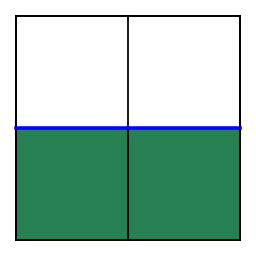

# Examples #

An example script is provided here: [example.py](example.py).

## System requirement ##

- [Python](https://www.python.org/downloads/) version `>=3.10` (currently tested on version `3.11`).

## Usage ##

The intended use is to install the code in this repository as a python package.
For installation and usage follow the following steps:[^1]

1. In a bash terminal call

    ```bash
    python3 -m pip install git+https://github.com/raj-open/fractal.git@main
    ```

2. Within the [examples](.) folder call

    ```bash
    python3 example.py
    ```

Alternative, esp. for those who prefer to work with the code in an open source manner (e.g. to modify parts of it),
one can clone the repository and run the example script as follows:[^1]

1. Clone or download this repository.

2. Install the requirements via

    ```bash
    python3 -m pip install -r requirements.txt
    ```

    or `just build-requirements`
    or `just build`
    for those with the [justfile](https://github.com/casey/just) tool.[^2]

3. In the [examples](.) folder run

      ```bash
      python3 example_open_source.py
      ```

## Outputs ##

Running the examples should generate the following plots in the [./examples/out](out) folder:


| $n$ | Peano curve at iteration $n$ |
| :-: | :--------------------------: |
| 0 |  |
| 1 |  |
| 2 |  |
| 3 |  |
| 4 |  |

---

[^1]: Windows users should use `py -3` instead of `python3`.
[^2]: This step is only needed once.
